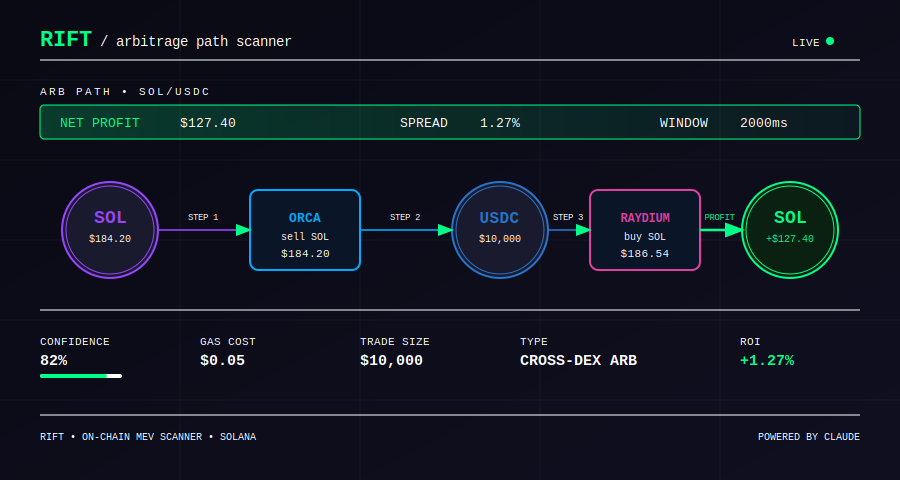
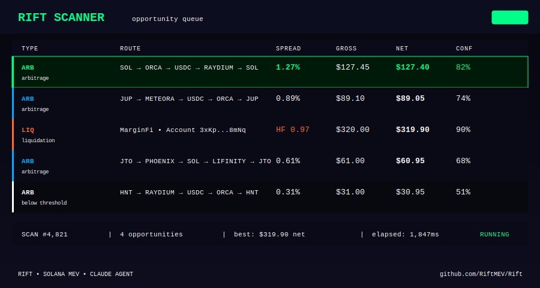

<div align="center">

# Rift

**On-chain MEV opportunity scanner for Solana.**
Detects cross-DEX arbitrage and liquidation candidates every 3 seconds. Runs them through Claude to assess viability before you act.

[](https://github.com/RiftMEV/Rift/actions)

[](https://docs.anthropic.com/en/docs/agents-and-tools/claude-agent-sdk)

</div>

---

MEV isn't just for bots with custom validators. There's a layer of opportunity visible to anyone watching closely — price spreads between DEXes, accounts teetering on liquidation thresholds, short windows where the math clearly works. `Rift` scans for all of it. Every 3 seconds it queries Jupiter and MarginFi, computes net profit after gas, and passes the best opportunities to Claude for a plain-language verdict: act, skip, or watch.

```
SCAN → FILTER → EVALUATE → RANK → REPORT
```

---

## Arbitrage Path



---

## Opportunity Scanner



---

## Opportunity Types

| Type | Source | Trigger |
|------|--------|---------|
| **arbitrage** | Jupiter V6 | Price spread > 0.3% across DEX routes |
| **liquidation_arb** | MarginFi | Health factor < 1.05 |
| **jit_liquidity** | Custom | Detected large pending swap |
| **sandwich_defense** | Custom | Identify sandwichable transactions |

---

## Quick Start

```bash
git clone https://github.com/RiftMEV/Rift
cd Rift && bun install
cp .env.example .env
bun run dev
```

---

## License

MIT

---

*the spread is always there.*
